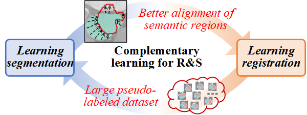

# BRBS! Learning Better Registration to Learn Better Few-Shot Medical Image Segmentation: Authenticity, Diversity, and Robustness

[NEWS!]**This paper has been accpeted by TNNLS2022! The basic code on [pytorch](https://github.com/YutingHe-list/BRBS/tree/main/pytorch) has been opened!**

[NOTE!!]**The code will be gradually and continuously opened!**

BRBS address the task of few-shot medical image segmentation (MIS) with a novel proposed framework based on the learning registration to learn segmentation (LRLS) paradigm. To cope with the limitations of lack of diversity, authenticity, and robustness in the existing LRLS frameworks, the BRBS framework utilizes the complementary between the registration ans segmentation, and makes three main contributions that are experimentally shown to have substantial practical merit. Without any bells and whistles, our approach achieves a new state-of-the-art performance in few-shot MIS tasks, and will provide a powerful few-shot benchmark for the field of medical image and efficiently reduce the costs of medical image research.


<p align="center"></p>

## Paper
This repository provides the official PyTorch and MindSpore implementation of BRBS in the following papers:

**[Learning Better Registration to Learn Better Few-Shot Medical Image Segmentation: Authenticity, Diversity, and Robustness](https://ieeexplore.ieee.org/abstract/document/9842340)** <br/> 
[Yuting He](http://19951124.academic.site/?lang=en), [Guanyu Yang*](https://cse.seu.edu.cn/2019/0103/c23024a257233/page.htm), Rongjun Ge, Xiaoming Qi, Yang Chen, Jiasong Wu,  Jean-Louis Coatrieux,  [Shuo Li](http://www.digitalimaginggroup.ca/members/shuo.php) <br/>
Southeast University <br/>
**IEEE Transactions on Neural Networks and Learning Systems**<br/>

## Citation
If you use this code or use our pre-trained weights for your research, please cite our papers:
```
@ARTICLE{9842340,
  author={He, Yuting and Ge, Rongjun and Qi, Xiaoming and Chen, Yang and Wu, Jiasong and Coatrieux, Jean-Louis and Yang, Guanyu and Li, Shuo},
  journal={IEEE Transactions on Neural Networks and Learning Systems}, 
  title={Learning Better Registration to Learn Better Few-Shot Medical Image Segmentation: Authenticity, Diversity, and Robustness}, 
  year={2022},
  volume={},
  number={},
  pages={1-14},
  doi={10.1109/TNNLS.2022.3190452}}
```

## Official implementation
- [PyTorch/](https://github.com/YutingHe-list/BRBS/tree/main/pytorch)
- [MindSpore/](https://github.com/YutingHe-list/BRBS/tree/main/mindspore)

## Acknowledgments

This research was supported by the National Key Research and Development Program of China (2017YFC0109202), National Natural Science Foundation under grants (31800825, 31571001, 61828101), Excellence Project Funds of Southeast University, CAAI-Huawei MindSpore Open Fund and Scientific Research Foundation of Graduate School of Southeast University (YBPY2139). We thank the Big Data Computing Center of Southeast University for providing the facility support on the numerical calculations in this paper. 
